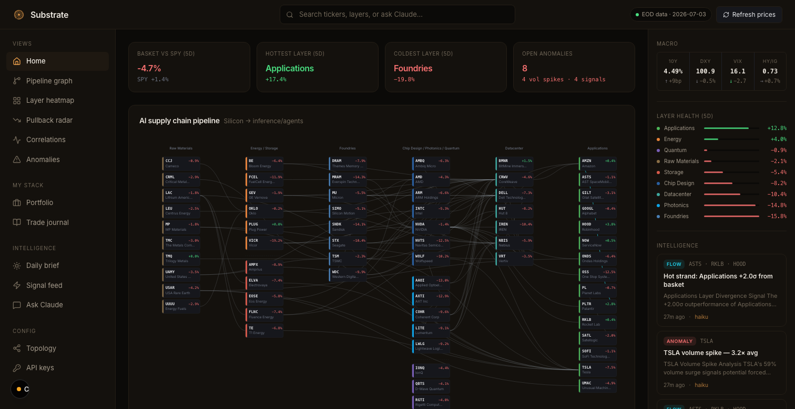

# Substrate

> The AI value chain, as a connected graph — silicon → inference/agents.

An equity research tool that maps the entire AI supply chain — raw materials to chips to
datacenters to the applications on top — as a graph of layers, not just a list of tickers.
Built to dissect where momentum and stress flow **between** layers, and to spot buy/sell
setups from price action, informed by your own strategy, your portfolio, and Claude's insights.



Built as a supporting research tool alongside Robinhood. The specialization is **layer health**:
surfacing cross-layer dynamics, correlation breaks, and volume anomalies that aren't visible in a
standard brokerage. A Robinhood MCP integration (agentic account access) is on the roadmap.

---

## Architecture

```
                ┌──────────────────────────────┐
                │  topology.yaml (repo root)   │
                │  70 tickers · 9 layers ·     │
                │  93 supply chain edges       │
                └──────────────┬───────────────┘
                               │
              ┌────────────────┴────────────────┐
              ▼                                 ▼
   ┌─────────────────────┐         ┌────────────────────────┐
   │  Python agent       │         │  Next.js dashboard     │
   │  agent/refresh.py   │         │  (this app)            │
   │  agent/insights.py  │         │                        │
   └──────────┬──────────┘         └──────────┬─────────────┘
              │                                │
              │   writes                       │   reads
              ▼                                ▼
        ┌─────────────────────────────────────────────┐
        │            Supabase (Postgres)              │
        │  tickers · prices · holdings · insights ·   │
        │  refresh_log · conversations · messages     │
        └─────────────────────────────────────────────┘
```

**Invariants:**
- The Python agent is the only writer to `tickers`, `prices`, `insights`, `refresh_log`
- Next.js writes only to `holdings`, `conversations`, `messages`
- `ANTHROPIC_API_KEY` is server-side only — never exposed to the browser

---

## Features

| View | What it does |
|---|---|
| **Pipeline graph** | Left-to-right SVG of the full AI supply chain, colored by today's performance |
| **Layer heatmap** | All 70 tickers grouped by layer, heat-colored by 1d/5d/1m/YTD return |
| **Pullback radar** | High-beta names sorted by distance from 52w high, RSI, and MA signals |
| **Correlations** | Layer-to-layer 90d correlation matrix + recently decoupled pairs |
| **Anomalies** | Layer divergence z-scores, volume spikes, detected signals |
| **Portfolio** | Holdings tracker with layer allocation donut and P&L |
| **Trade journal** | Trade thesis log with options tracking (strike, expiry, ITM/OTM) |
| **Daily brief** | On-demand EOD report: layer health, movers, portfolio, open setups |
| **Signal feed** | Chronological stream of detected anomaly / flow / signal insights |
| **Ask Claude** | Conversational analyst grounded in topology + live prices + your positions |

Plus config views (**Topology**, **API keys**) and a per-ticker detail page (`/ticker/[symbol]`)
with a YTD chart, key stats, and its upstream/downstream neighbors.

---

## Stack

- **Frontend:** Next.js 16 (App Router) + TypeScript + Tailwind CSS
- **Database:** Supabase (Postgres)
- **Data pipeline:** Python ≥3.13 + `uv` — `agent/refresh.py` pulls EOD prices via yfinance
- **AI:** Anthropic SDK — `claude-sonnet-4-6` for reports and Ask Claude,
  `claude-haiku-4-5-20251001` for routine anomaly/flow detection narratives
- **Charts:** Recharts. Pipeline graph is hand-built SVG.
- **Icons:** Lucide React

No shadcn/ui, no react-flow, no component libraries — Tailwind primitives only.

---

## Setup

### 1. Create Supabase project

Create a free project at [supabase.com](https://supabase.com). Copy the project URL, anon key, and service role key.

Run the migrations in the Supabase SQL Editor (in order):
```sql
-- supabase/migrations/*.sql
```

### 2. Configure environment

```bash
cp .env.local.example .env.local
# Fill in NEXT_PUBLIC_SUPABASE_URL, NEXT_PUBLIC_SUPABASE_ANON_KEY,
# SUPABASE_SERVICE_ROLE_KEY, ANTHROPIC_API_KEY
```

### 3. Install and run

```bash
npm install
npm run dev
```

`predev`/`prebuild` automatically regenerate the topology and watchlist TypeScript from
`topology.yaml` — no manual codegen step needed.

### 4. Initial data load

```bash
cd agent
cp .env.example .env
# Fill in SUPABASE_URL, SUPABASE_SERVICE_ROLE_KEY, ANTHROPIC_API_KEY

uv sync
uv run python refresh.py -v --period 2y   # initial backfill (~2 min)
uv run python insights.py                  # generate first insights
```

### 5. Schedule daily refresh

```cron
# Weekdays after market close (adjust timezone)
0 17 * * 1-5 cd /path/to/substrate/agent && uv run python refresh.py --period 1mo
30 17 * * 1-5 cd /path/to/substrate/agent && uv run python insights.py
```

---

## Topology

The supply chain is defined in `topology.yaml` — 9 layers, 70 tickers, 93 directional edges
encoding real supplier relationships. Edit this file to add tickers or adjust the graph. The
TypeScript types are auto-generated at build time via `scripts/gen-topology-ts.mjs`.

Layers: Raw Materials → Energy → Storage → Foundries/Memory → Chip Design → Quantum → Photonics → Datacenter → Applications

---

## Cost

- **Supabase:** Free tier (500MB, more than enough)
- **yfinance:** Free (EOD prices)
- **Anthropic:** ~$2–5/month with daily briefs + moderate Ask Claude usage

---

> **Disclaimer:** Not financial advice. For personal research use only.
